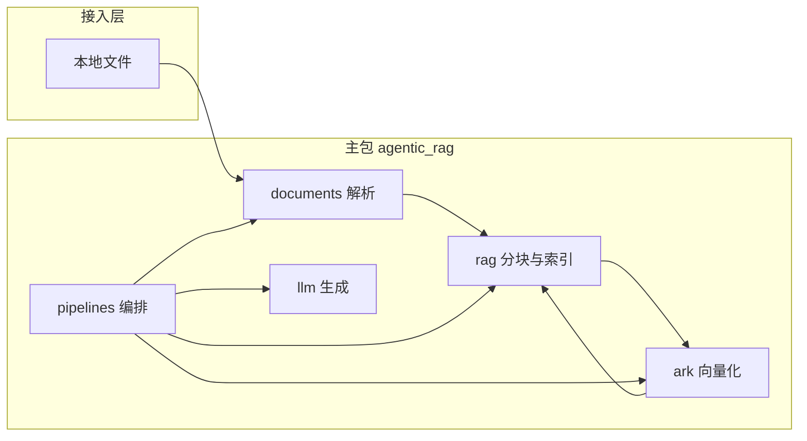

# 项目架构与协作说明

本文描述 **Agentic RAG** 的代码布局、数据流、模块职责与团队协作约定。使用方式与运行入口仍以根目录 [README.md](README.md) 为准。

---

## 1. 总览

本地文档 → **解析** → **分块** → **火山方舟多模态向量（仅文本项）** → **内存索引** → **余弦 Top-K** → **DeepSeek 对话生成**。



`pipelines` 是唯一把各层串成「一条 RAG 业务」的模块；底层包不依赖 `pipelines`，避免循环引用。

### 1.1 入口分层与扩展约定（重要）

| 层级 | 职责 |
|------|------|
| **`documents` / `ark` / `rag` / `llm`** | **领域能力**：解析、向量、索引、对话；**互不依赖** `pipelines`，便于单测与替换实现。 |
| **`pipelines`** | **编排**：`build_vector_index`、`answer_with_index`、`local_rag_answer` 等，组合底层调用。 |
| **`experiment`** | **运行快照**：`RunProfile`（开关组合）+ `run_document_rag`，把编排封装成**带参数的 JSON 友好出口**，供 CLI / 自动化使用。 |
| **根目录 `main.py`** | **统一 CLI**：`hub`（工作台）、`chat`、`rag`、`agent`（多层级编排）、`kb ingest`（知识库入库）、`experiment` / `score` / `demo` / `ui`、`session`（运行偏好 YAML）；详见 README。`run_rag.py` 仅为 **`main.py rag` 的别名**。 |
| **`src/agentic_rag/cli/`** | 子命令实现与演示函数（`app.py`、`demos.py`）；**新增入口不要新建根目录 `*_demo.py`**，在本目录接线后挂到 `main.py`。 |

扩展新功能时：**先在底层或 `pipelines` 实现函数接口** → **`cli/app.py` 注册子命令**（或扩展 `experiment/runner.py` / `RunProfile`）。需要「关掉某能力」时，用 Profile 布尔项或 CLI（如 `--no-chroma`）即可。

---

## 2. 目录树与职责

项目根仅保留**可执行入口**与工程元数据；可复用逻辑全部在 `src/agentic_rag/`。

```
项目根/
├── main.py                 # **统一入口**：hub / chat / rag / agent / kb / experiment / score / demo / ui / session
├── run_rag.py              # 别名：等价于 ``python main.py rag …``
├── run_batch_experiments.py # C0/C1 批量（亦可 ``main.py experiment batch``）
├── run_c2_retrieval_ablation.py # C2 消融（亦可 ``main.py experiment c2``）
├── configs/
│   └── run_default.yaml    # RunProfile 默认值参考（可选）
├── pyproject.toml
├── uv.lock
├── .env.example
├── .gitignore
├── README.md
├── ARCHITECTURE.md         # 本文件
└── src/
    └── agentic_rag/
        ├── __init__.py
        ├── config.py
        ├── documents/
        ├── tools/            # 可选：MarkItDown 等（未接入默认 parse）
        ├── ark/
        ├── llm/
        ├── rag/
        ├── pipelines/
        └── experiment/       # RunProfile + run_document_rag（统一入口编排）
```

### 2.1 根文件

| 文件 | 作用 |
|------|------|
| `config.py`（包内） | 自项目根加载 `.env`，集中提供 `ARK_*`、`DEEPSEEK_*` 等配置，业务代码不直接散写 `os.getenv`。 |
| `main.py` | 验证 `DEEPSEEK_API_KEY` 后，单轮调用 DeepSeek。 |
| `demo.py` | 对指定路径建 `SimpleVectorIndex` 一次，循环读入问题并 `answer_with_index`；仅问题走向量化。 |
| `rag_demo.py` | 命令行两参数：文档路径 + 问题，内部 `local_rag_answer`（每次全链路）。 |
| `upload_demo.py` | Gradio UI：上传文件 + 问题，调用 `local_rag_answer`。 |

### 2.2 `src/agentic_rag/`（包根）

| 文件 | 作用 |
|------|------|
| `__init__.py` | 包版本等元信息。 |
| `config.py` | 方舟 Base URL、API Key、Embedding 模型与维度；DeepSeek Base URL、Key、对话模型名。 |

### 2.3 `documents/` — 文档接入

| 路径 | 作用 |
|------|------|
| `documents/__init__.py` | 对外导出 `parse_path`、`ParsedDocument`、`UnsupportedFormatError`。 |
| `documents/models.py` | `ParsedDocument` 数据结构（如路径、正文）。 |
| `documents/parse.py` | 按扩展名解析 `.txt` / `.md` / `.pdf` / `.docx` → 纯文本。 |
| `documents/errors.py` | `UnsupportedFormatError` 等解析侧异常。 |

### 2.4 `tools/` — 可插拔工具（与默认解析并行）

| 路径 | 作用 |
|------|------|
| `tools/__init__.py` | 导出 MarkItDown 封装：`MarkdownConversionResult`、`convert_local_file_to_markdown`。 |
| `tools/markitdown_tool.py` | 使用 **MarkItDown.convert_local** 将本地文件转为 Markdown；**尚未**接入 `documents.parse_path`，供后续 Agent 或增强解析路径按需调用。 |

### 2.5 `ark/` — 火山方舟向量

| 路径 | 作用 |
|------|------|
| `ark/__init__.py` | 导出 `embed_texts`。 |
| `ark/embeddings.py` | `POST .../embeddings/multimodal`；纯文本 RAG 使用 `input: [{"type":"text","text":...}]`；支持查询侧前缀与批处理/降级逐条请求。 |

### 2.6 `llm/` — 对话客户端

| 路径 | 作用 |
|------|------|
| `llm/__init__.py` | 导出 `create_deepseek_client`。 |
| `llm/deepseek.py` | 基于 OpenAI 兼容协议构造 DeepSeek 客户端，供 `pipelines` 与 `main.py` 使用。 |

### 2.7 `rag/` — 与厂商无关的检索核心

| 路径 | 作用 |
|------|------|
| `rag/__init__.py` | 导出 `SimpleVectorIndex`、`chunk_text`、`cosine_sim`。 |
| `rag/simple.py` | 固定窗口分块（含 overlap）、余弦相似度、内存中的向量与文本列表、`top_k` 检索。 |
| `rag/chroma_store.py` | Chroma 持久化：单文档集合名基于文件指纹；全库集合名 `ragkb_kb_<kb_fingerprint>`（与 `documents.csv` 及切块参数绑定）。与嵌入模型/维度不一致时丢弃缓存并重写。**本地 PersistentClient 非线程安全**，对本模块内读写使用 `RLock` 串行化，避免 LangGraph 并发工具调用时出现集合不存在类错误。默认目录见 `CHROMA_PERSIST_DIRECTORY`。 |

### 2.8 `experiment/` — 统一出口（与脚本解耦）

| 路径 | 作用 |
|------|------|
| `experiment/profile.py` | `RunProfile`：本次运行开关（如 `use_chroma_cache`、`top_k`；预留混合检索、rewrite 等）。 |
| `experiment/runner.py` | `run_document_rag`（单文档）；`run_knowledge_base_rag`（全库：`documents.csv` → `kb_index_builder.load_or_build_knowledge_index`，与批量实验共用 Chroma 索引）。 |
| `experiment/kb_index_builder.py` | 全库切块、方舟 embedding、`chunks.jsonl` 维护；指纹变更则重建向量并写入 Chroma。 |
| `experiment/kb_ingest.py` | 将用户文件登记入 `documents.csv`、复制至 `data/raw/user_docs/`（可选）、触发 `force_rebuild` 重建全库索引；供 CLI `main.py kb ingest` 与 Agent 工具 `topic4_kb_ingest` 调用。 |

### 2.9 `deep_planning/` 与 `orchestration/` — `main.py agent` 多层级编排

**来源说明**：多轮规划—执行—研判的**调度外壳**（`orchestration/`、`loop`、`OrchestrationConfig`、与 `main.py agent` 的接线）为课题迭代中**新增/重写**；**复用**仓库既有 **`experiment.runner`**（单文档/全库 RAG）、**`kb_index_builder`**、**`rag/chroma_store`**、**`deep_planning`** 内对 `run_document_rag` / `run_knowledge_base_rag` 的工具封装及 **`presets.RunProfile`**，评测链路的 JSON 结构化思路则体现在 **`kb_grounding`** 等模块，不等同于复制既有批量脚本本身。

| 路径 | 作用 |
|------|------|
| `deep_planning/session_planner.py` | **第一层**：DeepSeek 结构化规划（路径候选、任务摘要、`plan_for_layer2`、管线建议）；仅输出 JSON，不调工具。 |
| `deep_planning/agent_runner.py` | `build_deepseek_chat_model`、`build_topic4_deep_agent`；第二层系统提示定义工具边界（RAG / 入库 / 可选沙箱）。 |
| `deep_planning/tools_factory.py` | LangChain 工具：`topic4_rag_query`（默认走 `run_knowledge_base_rag`；绑单文档时 `run_document_rag`）、`topic4_kb_ingest`、`topic4_list_rag_pipelines`、可选 `sandbox_exec_python`。 |
| `deep_planning/presets.py` | RAG 管线预设（`project_default`、`c0_naive`、C2 阶段等），与 `RunProfile` 对齐。 |
| `deep_planning/agent_cli.py` | `main.py agent` 参数：`--once-file`、`--stdin`、`--single-line`（关闭默认多行）、OrchestrationConfig 开关等。 |
| `orchestration/loop.py` | **调度循环**：规划 → 构建 Agent → 执行 → **可选**知识库对齐核验 → 第三层研判 → 重试/重规划；交互默认**多行输入**，单独一行 `END`/`end` 结束。 |
| `orchestration/kb_grounding.py` | 检索摘录 vs 答复的对齐核验（DeepSeek JSON），供研判参考。 |
| `orchestration/judge_layer.py` | **第三层**：达标与否与 `verdict`（complete / continue_execute / replan / need_user_input）。 |
| `orchestration/types.py` | `OrchestrationConfig`、`JudgeVerdict` 等。 |

**检索范围约定**：未解析到有效单文件路径时，第二层默认 **Chroma 全库**（`data/processed/documents.csv`）；命令行传入文档路径则对该文件建索引检索。测试集 `data/testset/references.csv` 仅用于评测对照，**不是**向量库清单。

**依赖组**：`agent` 功能需 `uv sync --group agent`（deepagents、langchain-openai）。

### 2.10 `pipelines/` — 业务编排

| 路径 | 作用 |
|------|------|
| `pipelines/__init__.py` | 导出 `build_vector_index`、`answer_with_index`、`local_rag_answer`。 |
| `pipelines/local_rag.py` | `build_vector_index`：解析 → 分块 → `embed_texts(is_query=False)`；`answer_with_index`：问题 `embed_texts(is_query=True)` → Top-K → DeepSeek；`local_rag_answer` 为一次性封装。 |

### 2.11 配置与密钥加载（`config.py`）

- `PROJECT_ROOT`：与 `pyproject.toml` 同目录，用于全库路径、`kb_ingest`、Agent 工具路径校验。
- `.env`：优先加载项目根 `.env`（`override=True`，避免 shell 中空变量挡住文件中的密钥）；父目录 `.env` 次之。`DEEPSEEK_API_KEY` 未设时可回退 `OPENAI_API_KEY`（兼容 `.env.example` 写法）。
- 沙箱（可选）：`SANDBOX_ENABLED`、`SANDBOX_TIMEOUT_SEC`、`SANDBOX_MAX_CODE_CHARS`。

---

## 3. 依赖方向（约定）

- 允许：`pipelines` → `documents` / `ark` / `llm` / `rag`（未来可按需引用 `tools`）。
- 允许：`experiment` → `pipelines`（仅编排与快照，不反向引用脚本）。
- 禁止：`documents`、`ark`、`llm`、`rag`、`tools` 依赖 `pipelines`。
- `config` 可被任意层读取；不在 `config` 以外重复实现「读 `.env`」逻辑（入口脚本通过首次 `import agentic_rag.*` 触发加载即可）。

---

## 4. 协作规范

### 4.1 环境与密钥

- 复制 `.env.example` 为本地 `.env`，**永不将 `.env`、密钥、Token 提交进仓库**。
- 提交前执行 `git status`，确认无敏感文件。
- 各成员在方舟 / DeepSeek 控制台自行创建密钥；模型 ID、Endpoint ID 以控制台为准。

### 4.2 依赖与运行

- 使用 **uv**：`uv sync` 安装锁定版本；新增依赖后更新 `pyproject.toml` 并执行 `uv lock`。
- Python 版本：`>=3.11`（见 `pyproject.toml`）。

### 4.3 Git 与提交信息

- 建议采用 [Conventional Commits](https://www.conventionalcommits.org/zh-hans/)：
  - `feat:` 新功能  
  - `fix:` 修复  
  - `docs:` 文档（含 `README` / `ARCHITECTURE.md`）  
  - `refactor:` 重构（行为不变）  
  - `chore:` 构建、依赖、杂项  
- 示例：`feat(ark): support optional embedding batch size`

### 4.4 代码与评审

- 与厂商相关的调用集中在 `ark/`、`llm/`；检索与分块逻辑留在 `rag/`，便于替换向量或 LLM 供应商。
- 新增目录或公共 API 时，同步更新 `ARCHITECTURE.md` 与本包 `__init__.py` 的导出。
- 避免在无关文件中「顺手重构」；合并请求保持单一主题，便于审查。

### 4.5 文档分工

- **README.md**：面向使用者的安装、配置、运行命令与简要说明。
- **ARCHITECTURE.md**：面向贡献者的结构、模块边界与协作约定（本文）。

---

## 5. 修订记录

架构或目录有重大变更时，请在本节或提交说明中简要记录，便于后来者溯源。

| 日期 | 摘要 |
|------|------|
| 2026-05-11 | 补充：`main.py agent` **新增编排层**（调度循环与 CLI；复用既有 RAG/全库构建）、`kb ingest`、全库 `run_knowledge_base_rag`、`chroma_store` 线程安全锁、`config` 与交互 CLI 约定；三层职能见 `.cursor/skills/topic4-orchestration-layers/SKILL.md`。实验细节见 `docs/experiment_notes.md` 同日条目（李金航）。 |
