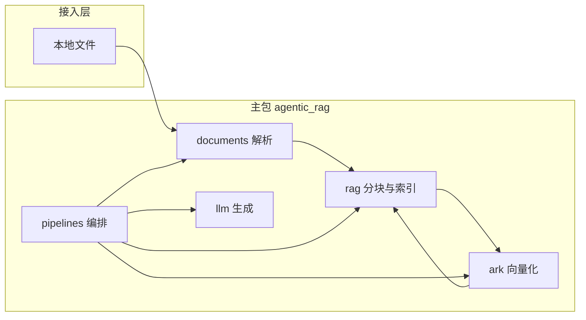
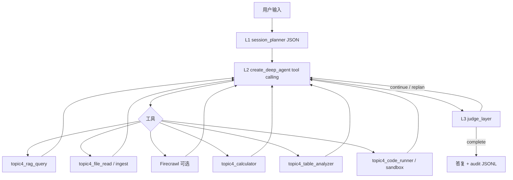

# 项目架构与协作说明

本文描述 **Agentic RAG** 的代码布局、数据流、模块职责与团队协作约定。使用方式与运行入口仍以根目录 [README.md](README.md) 为准。

---

## 1. 总览

本地文档 → **解析** → **分块** → **火山方舟多模态向量（仅文本项）** → **内存索引** → **余弦 Top-K** → **DeepSeek 对话生成**。



`pipelines` 是唯一把各层串成「一条 RAG 业务」的模块；底层包不依赖 `pipelines`，避免循环引用。

### 1.1 入口分层与扩展约定（重要）

| 层级 | 职责 |
|------|------|
| **`documents` / `ark` / `rag` / `llm`** | **领域能力**：解析、向量、索引、对话；**互不依赖** `pipelines`，便于单测与替换实现。 |
| **`pipelines`** | **编排**：`build_vector_index`、`answer_with_index`、`local_rag_answer` 等，组合底层调用。 |
| **`experiment`** | **运行快照**：`RunProfile`（开关组合）+ `run_document_rag`，把编排封装成**带参数的 JSON 友好出口**，供 CLI / 自动化使用。 |
| **根目录 `main.py`** | **统一 CLI**：`hub`（工作台 **[5] 可启动 C3/C4**）、`chat`、`rag`、`agent`（多层级编排）、**`client`**（C3/C4 统一 Gradio/控制台，支持 **全库+附加融合检索**）、`kb sync|reset`（系统全库）、`experiment` / `score` / `demo` / `ui`、`session`（运行偏好 YAML）、**`runtime repl|headless`**；详见 README「产品入口」。`run_rag.py` 仅为 **`main.py rag` 的别名**。 |
| **`src/agentic_rag/cli/`** | 子命令实现与演示函数（`app.py`、`c34_client.py`、`demos.py`）；**新增入口不要新建根目录 `*_demo.py`**，在本目录接线后挂到 `main.py`。 |
| **`src/agentic_rag/runtime/`** | **Agent Runtime 骨架**：`QueryEngine` 包装既有编排；REPL/headless 与 `main.py client` 共用推理路径（见 `docs/agent_runtime_architecture.md`）。 |

扩展新功能时：**先在底层或 `pipelines` 实现函数接口** → **`cli/app.py` 注册子命令**（或扩展 `experiment/runner.py` / `RunProfile`）。需要「关掉某能力」时，用 Profile 布尔项或 CLI（如 `--no-chroma`）即可。

---

## 2. 目录树与职责

项目根仅保留**可执行入口**与工程元数据；可复用逻辑全部在 `src/agentic_rag/`。

```
项目根/
├── main.py                 # **统一入口**：hub / chat / rag / agent / kb / experiment / score / demo / ui / session
├── run_rag.py              # 别名：等价于 ``python main.py rag …``
├── run_batch_experiments.py # C0/C1 批量（亦可 ``main.py experiment batch``）
├── run_c2_retrieval_ablation.py # C2 消融（亦可 ``main.py experiment c2``）
├── run_c34_batch_eval.py    # C3/C4 批量（亦可 ``main.py experiment c34``）
├── configs/
│   └── run_default.yaml    # RunProfile 默认值参考（可选）
├── pyproject.toml
├── uv.lock
├── .env.example
├── .gitignore
├── README.md
├── ARCHITECTURE.md         # 本文件
└── src/
    └── agentic_rag/
        ├── __init__.py
        ├── config.py
        ├── documents/
        ├── tools/            # MarkItDown、Firecrawl、file_tool、calculator、table_analyzer、code_runner
        ├── sandbox/          # 本地子进程沙箱（topic4_code_runner 底层）
        ├── ark/
        ├── llm/
        ├── rag/
        ├── cli/                # app.py、c34_client.py（C3/C4 产品入口）
        ├── runtime/            # QueryEngine、REPL、headless、tools/governance
        ├── telemetry/          # 客户端审计 JSONL（不参与模型）
        ├── orchestration/      # 规划→执行→研判调度循环
        ├── deep_planning/      # L1 规划、L2 Agent、工具工厂
        ├── pipelines/
        └── experiment/       # RunProfile + run_document_rag（统一入口编排）
```

### 2.1 根文件

| 文件 | 作用 |
|------|------|
| `config.py`（包内） | 自项目根加载 `.env`，集中提供 `ARK_*`、`DEEPSEEK_*` 等配置，业务代码不直接散写 `os.getenv`。 |
| `main.py` | 验证 `DEEPSEEK_API_KEY` 后，单轮调用 DeepSeek。 |
| `demo.py` | 对指定路径建 `SimpleVectorIndex` 一次，循环读入问题并 `answer_with_index`；仅问题走向量化。 |
| `rag_demo.py` | 命令行两参数：文档路径 + 问题，内部 `local_rag_answer`（每次全链路）。 |
| `upload_demo.py` | Gradio UI：上传文件 + 问题，调用 `local_rag_answer`。 |

### 2.2 `src/agentic_rag/`（包根）

| 文件 | 作用 |
|------|------|
| `__init__.py` | 包版本等元信息。 |
| `config.py` | 方舟 Base URL、API Key、Embedding 模型与维度；DeepSeek Base URL、Key、对话模型名。 |

### 2.3 `documents/` — 文档接入

| 路径 | 作用 |
|------|------|
| `documents/__init__.py` | 对外导出 `parse_path`、`ParsedDocument`、`UnsupportedFormatError`。 |
| `documents/models.py` | `ParsedDocument` 数据结构（如路径、正文）。 |
| `documents/parse.py` | 按扩展名解析 `.txt` / `.md` / `.pdf` / `.docx` → 纯文本（入库/RAG 默认链；**不支持**旧版 `.doc`）。 |
| `documents/multi_doc.py` | 多文档路径解析（自然语言/列表）、`SessionDocumentScope`、`build_session_document_scope`（可选入库 Chroma）。 |
| `documents/ingest_inspector.py` | **传入文件检查**（SHA256、重复路径/重复内容、`duplicate_content_in_kb`）；`resolve_session_doc_ids` 在内容重复时**复用已有 doc_id、跳过重复入库**。 |
| `documents/errors.py` | `UnsupportedFormatError` 等解析侧异常。 |

### 2.4 `tools/` — 可插拔工具（与默认解析并行）

| 路径 | 作用 |
|------|------|
| `tools/__init__.py` | 导出 MarkItDown 封装等。 |
| `tools/markitdown_tool.py` | [MarkItDown](https://github.com/microsoft/markitdown) 将**工程根内**文件转 Markdown；由 `topic4_file_read` 在根内分支调用，与 `documents.parse_path` 并行。 |
| `tools/file_tool.py` | C4 **`topic4_file_read`** / **`topic4_file_ingest`** 底层：读盘（根内 MarkItDown、根外只读解析）、入库（盘外复制到 `data/raw/user_docs/`）。 |
| `tools/firecrawl_tool.py` | C4 **Firecrawl**（`firecrawl-py`）：`topic4_firecrawl_scrape` / `search` / `scrape_to_kb`；快照目录 `data/raw/web_snapshots/`。 |
| `tools/calculator_tool.py` | C4 **`topic4_calculator`**：AST 白名单安全算术（题集 `calculation`）。 |
| `tools/table_analyzer_tool.py` | C4 **`topic4_table_analyzer`**：pandas 读 CSV/TSV（跳过 Markdown 前言）；非 MarkItDown。 |
| `tools/code_runner_tool.py` | C4 **`topic4_code_runner`**：会话沙箱内跑 Python，可选 `read_only_paths` 挂载工程内文件副本。 |
| `tools/response_format.py` | 第二层工具统一 JSON：`schema_version: topic4.tool.v1`。 |
| `sandbox/local_subprocess.py` | `exec_python_snippet`：`cwd`=临时目录，超时 `SANDBOX_TIMEOUT_SEC`（**非**远端 sandbox）。 |

### 2.5 `ark/` — 火山方舟向量

| 路径 | 作用 |
|------|------|
| `ark/__init__.py` | 导出 `embed_texts`。 |
| `ark/embeddings.py` | `POST .../embeddings/multimodal`；纯文本 RAG 使用 `input: [{"type":"text","text":...}]`；支持查询侧前缀与批处理/降级逐条请求。 |

### 2.6 `llm/` — 对话客户端

| 路径 | 作用 |
|------|------|
| `llm/__init__.py` | 导出 `create_deepseek_client`。 |
| `llm/deepseek.py` | 基于 OpenAI 兼容协议构造 DeepSeek 客户端，供 `pipelines` 与 `main.py` 使用。 |

### 2.7 `rag/` — 与厂商无关的检索核心

| 路径 | 作用 |
|------|------|
| `rag/__init__.py` | 导出 `SimpleVectorIndex`、`chunk_text`、`cosine_sim`。 |
| `rag/simple.py` | 固定窗口分块（含 overlap）、余弦相似度、内存中的向量与文本列表、`top_k` 检索。 |
| `rag/chroma_store.py` | Chroma 持久化：单文档集合名基于文件指纹；全库集合名 `ragkb_kb_<kb_fingerprint>`（与 `documents.csv` 及切块参数绑定）。与嵌入模型/维度不一致时丢弃缓存并重写。**本地 PersistentClient 非线程安全**，对本模块内读写使用 `RLock` 串行化，避免 LangGraph 并发工具调用时出现集合不存在类错误。默认目录见 `CHROMA_PERSIST_DIRECTORY`。 |

### 2.8 `experiment/` — 统一出口（与脚本解耦）

| 路径 | 作用 |
|------|------|
| `experiment/profile.py` | `RunProfile`：本次运行开关（如 `use_chroma_cache`、`top_k`；预留混合检索、rewrite 等）。 |
| `experiment/runner.py` | `run_document_rag`（单文档）；`run_knowledge_base_rag`（全库：`documents.csv` → `kb_index_builder.load_or_build_knowledge_index`，与批量实验共用 Chroma 索引）。 |
| `experiment/kb_index_builder.py` | 全库切块、方舟 embedding、`chunks.jsonl` 维护；`kb_fingerprint` 由 CSV 各行路径 **mtime/size** + 切块/embedding 参数计算（**非**内容 SHA256）；指纹不变可命中 Chroma；进程内 `_KB_INDEX_MEMORY` 复用 `SimpleVectorIndex`。 |
| `experiment/kb_ingest.py` | 单文件登记 `documents.csv` + `force_rebuild`；供 `main.py kb ingest`、**`topic4_file_ingest`**（仅系统 raw 路径）。 |
| `experiment/kb_sync.py` | **`main.py kb sync` / `kb reset`**：扫描 `data/raw` 系统子目录 → 重写 `documents.csv` → 重建 Chroma。 |
| `experiment/kb_chroma_admin.py` | **`main.py kb clear-chroma`**：删除 `CHROMA_PERSIST_DIRECTORY` 与内存缓存。 |
| `experiment/kb_paths.py` | 系统 raw 扫描范围与排除目录（`session_upload` 等）。 |
| `documents/session_index.py` | 会话附加文件**临时**切块索引（不写全库）。 |
| `experiment/session_rag.py` | 临时索引上下文；`run_ephemeral_session_rag`；**`run_combined_kb_ephemeral_rag`**（全库+附加融合）。 |

### 2.9 `deep_planning/` 与 `orchestration/` — `main.py agent` 多层级编排

**来源说明**：多轮规划—执行—研判的**调度外壳**（`orchestration/`、`loop`、`OrchestrationConfig`、与 `main.py agent` 的接线）为课题迭代中**新增/重写**；**复用**仓库既有 **`experiment.runner`**（单文档/全库 RAG）、**`kb_index_builder`**、**`rag/chroma_store`**、**`deep_planning`** 内对 `run_document_rag` / `run_knowledge_base_rag` 的工具封装及 **`presets.RunProfile`**，评测链路的 JSON 结构化思路则体现在 **`kb_grounding`** 等模块，不等同于复制既有批量脚本本身。

| 路径 | 作用 |
|------|------|
| `deep_planning/session_planner.py` | **第一层**：DeepSeek 结构化规划（`needs_web_tools` / `web_urls` / `local_paths`、`kb_mutation_intent`、`plan_for_layer2`）；C4 时 `format_c4_parsed_input_block` 向 L2 注入预解析链接与路径；仅 JSON，不调工具。 |
| `deep_planning/agent_runner.py` | `build_deepseek_chat_model`、`build_topic4_deep_agent`；L2 提示含 RAG、**`topic4_file_read`/`topic4_file_ingest`**、Firecrawl（C4）、可选沙箱。 |
| `deep_planning/tools_factory.py` | LangChain 工具注册与 `wrap_tools_with_audit`；C3 仅 RAG 两工具；C4 另 file/Firecrawl/**calculator/table_analyzer/code_runner**（+ 兼容 `sandbox_exec_python`）。 |
| `experiment/c34_batch.py` | C3/C4 批量：`resolve_batch_tasks`（`c3_smoke` / `c4_tools` / `main_20` / `ids`）+ 共用 `QueryEngine`。 |
| `telemetry/streaming_hooks.py` | 编排钩子合并 + `RuntimeEvent` 转发（Gradio 流式与批量 `--verbose-events`）。 |
| `deep_planning/presets.py` | RAG 管线预设（`project_default`、`c0_naive`、C2 阶段等），与 `RunProfile` 对齐。 |
| `deep_planning/agent_cli.py` | `main.py agent` 参数：`--once-file`、`--stdin`、`--single-line`（关闭默认多行）、OrchestrationConfig 开关等。 |
| `orchestration/loop.py` | **调度循环**：规划 → 构建 Agent → 执行 → **可选**知识库对齐核验 → 第三层研判 → 重试/重规划；向 L2 传入 `kb_doc_ids`、`cli_documents_hint`；交互默认**多行输入**，单独一行 `END`/`end` 结束。 |
| `orchestration/kb_grounding.py` | 检索摘录 vs 答复的对齐核验（DeepSeek JSON），供研判参考。 |
| `orchestration/judge_layer.py` | **第三层**：达标与否与 `verdict`（complete / continue_execute / replan / need_user_input）。 |
| `orchestration/types.py` | `OrchestrationConfig`、`JudgeVerdict` 等。 |

**检索范围约定**（`SessionDocumentScope.retrieval_mode`，由 `main.py client` / 工作台 [5] / `--retrieval-mode` 选择）：

| 模式 | 行为 |
|------|------|
| `full_kb` | 仅 **Chroma 全库**（`load_or_build_knowledge_index` → `run_knowledge_base_rag`） |
| `ephemeral_only` | 仅 **本会话临时索引**（附加文件，`run_ephemeral_session_rag`） |
| `full_kb_and_ephemeral` | **默认（有附加路径时）**：`run_combined_kb_ephemeral_rag` 对全库与临时索引分别检索，按 `chunk_id` 融合 Top-K 后一次生成答案 |

未绑定附加文件时默认 `full_kb`。`ingest_to_chroma=True` 时附加文件写入 `documents.csv` 后按 **doc_id 子集**检索。测试集 `data/testset/references.csv` 仅用于评测，**不是**向量库清单。

**启动示例**：

```powershell
uv sync --group agent
uv run python main.py kb sync
uv run python main.py client
uv run python main.py client --console --c4 --retrieval-mode full_kb_and_ephemeral D:\notes.pdf
uv run python main.py
# 工作台选 [5] → C3/C4 → 检索范围 → Gradio 或终端
```

**依赖组**：`agent` 功能需 `uv sync --group agent`（含 deepagents、langchain-openai、markitdown 等）。

### 2.10 `cli/` — 统一命令行与 C3/C4 客户端

| 路径 | 作用 |
|------|------|
| `cli/app.py` | `main.py` 子命令注册：`hub`、`rag`、`agent`、`client`、`kb`、`experiment`、`runtime` 等。 |
| `cli/c34_client.py` | **Topic4 C3/C4 统一客户端**：Gradio（默认，**流式** `_chat_stream` / `iter_c34_turn_stream`）或 `--console`；每轮 **`QueryEngine.submit_message`** + `streaming_hooks` 审计。 |
| `cli/hub.py` | 集成工作台：`[4]` 单文档 RAG；**`[5]`** 引导启动 C3/C4 并选择检索范围。 |
| `cli/demos.py` | 旧版 `main.py ui`：单文件 Gradio 上传 + `local_rag_answer`（**无**三层编排）。 |

**C3 vs C4（客户端）**：`OrchestrationConfig.enable_c4_tools`；C3 仅 `topic4_list_rag_pipelines` + `topic4_rag_query`；C4 另可 **file / Firecrawl / calculator / table_analyzer / code_runner**（沙箱须 `SANDBOX_ENABLED=true` 且会话传入 `sandbox_workspace`）。



**MarkItDown 与 table_analyzer 分工**：`topic4_file_read` 在工程根内把 Office/PDF 等转为 Markdown 文本；`topic4_table_analyzer` 对 **已是 CSV/TSV** 的文件做统计（`value_counts`、`column_mean` 等），二者不互相替代。

**客户端边界（2026-05-20）**：系统全库由 **`main.py kb sync`** 维护；会话附加文件默认 **全库+临时索引组合检索**（`full_kb_and_ephemeral`），亦可选仅临时或仅全库。临时索引仍不写 `documents.csv`。**`topic4_file_ingest`** 仅用于系统 raw 补登。URL 由 C4 Firecrawl 动态抓取。

**规划前查询改写**：`OrchestrationConfig.enable_planning_query_rewrite` 默认 **False**（Gradio 未暴露开关）；`main.py agent --planning-rewrite` 可开启。检索管线（如 `c2_stage3_context`）内的 C1 改写仍随 `RunProfile.use_query_rewrite` 生效。

### 2.11 `runtime/` — Agent Runtime 骨架

详见 **`docs/agent_runtime_architecture.md`**。

| 路径 | 作用 |
|------|------|
| `runtime/entrypoints/cli_router.py` | `--version` fast-path；`runtime` 子命令与回落 `cli/app.py`。 |
| `runtime/engine/query_engine.py` | 多轮 `submit_message`、复用 `agent` / `doc_resolved`。 |
| `runtime/engine/query_loop.py` | 包装 `orchestrate_user_turn`，捕获 stdout 为 transcript。 |
| `runtime/tools/governance.py` | 按 C3/C4 过滤工具名、装配 `tools_factory`。 |
| `runtime/interaction/repl.py` | Runtime REPL（`/quit`、`/retry` 等）。 |
| `runtime/headless/runner.py` | 无头批处理（`topic4.headless.v1` JSON）。 |
| `runtime/state/` | `AppState`、`AppStateStore`、`effects.py`。 |

### 2.12 `telemetry/` — 客户端审计（不参与模型）

| 路径 | 作用 |
|------|------|
| `telemetry/audit_log.py` | 追加 `runs/logs/audit/global_audit.jsonl`；`set_audit_session_id` 供 Gradio 线程显式绑定会话 id。 |
| `telemetry/client_hooks.py` | `build_client_audit_hooks(session_id=…)`、`log_turn_result(session_id=…)`：编排事件写入 **同一会话** `trace.jsonl`。 |
| `telemetry/chat_transcript.py` | `sessions/<id>/chat.jsonl` 每轮 user/assistant 全文；`turns_to_gradio_messages` 供恢复 UI。 |
| `telemetry/session_trace.py` | `sessions/<id>/trace.jsonl`：L1/L2/L3、`tool_invoke_*`、`rag_query_result`。 |
| `cli/logs_viewer.py` | **`main.py logs`** / 工作台 **[6]**：只读查看；**「继续对话」Tab** 生成 `client --resume-session` 命令。 |

与批量实验线 **`runs/logs/<config>/run_logs.jsonl`**（`RunProfile.save_jsonl_log`）分离：客户端默认不写实验 JSONL。

**恢复对话**：`uv run python main.py client --c4 --resume-session <审计id>` 从 `chat.jsonl` 回填 Gradio 聊天框并复用同一 `session_id` 追加日志；**不**恢复 LangGraph Agent 内部状态（新消息为新 Agent 实例）。

### 2.13 `pipelines/` — 业务编排

| 路径 | 作用 |
|------|------|
| `pipelines/__init__.py` | 导出 `build_vector_index`、`answer_with_index`、`local_rag_answer`。 |
| `pipelines/local_rag.py` | `build_vector_index`：解析 → 分块 → `embed_texts(is_query=False)`；检索支持 `allowed_doc_ids` 过滤；`answer_with_index` / `local_rag_answer` 为一次性封装。 |

### 2.14 配置与密钥加载（`config.py`）

- `PROJECT_ROOT`：与 `pyproject.toml` 同目录，用于全库路径、`kb_ingest`、Agent 工具路径校验。
- `.env`：优先加载项目根 `.env`（`override=True`，避免 shell 中空变量挡住文件中的密钥）；父目录 `.env` 次之。`DEEPSEEK_API_KEY` 未设时可回退 `OPENAI_API_KEY`（兼容 `.env.example` 写法）。
- 沙箱（可选）：`SANDBOX_ENABLED`、`SANDBOX_TIMEOUT_SEC`、`SANDBOX_MAX_CODE_CHARS`（本地 subprocess + 临时目录，非 VM）。更强隔离可选自建 [CubeSandbox](https://github.com/TencentCloud/CubeSandbox/blob/master/README_zh.md) 等兼容 E2B 的远端环境，与本仓库无自动对接。
- MarkItDown / `topic4_file_read`：`MARKITDOWN_MAX_FILE_BYTES`（单文件字节上限，防 OOM）。
- Firecrawl：`FIRECRAWL_API_KEY`、`FIRECRAWL_MAX_OUTPUT_CHARS`、`FIRECRAWL_SEARCH_LIMIT`（见 `.env.example`）。

---

## 3. 依赖方向（约定）

- 允许：`pipelines` → `documents` / `ark` / `llm` / `rag`（未来可按需引用 `tools`）。
- 允许：`experiment` → `pipelines`（仅编排与快照，不反向引用脚本）。
- 禁止：`documents`、`ark`、`llm`、`rag`、`tools` 依赖 `pipelines`。
- `config` 可被任意层读取；不在 `config` 以外重复实现「读 `.env`」逻辑（入口脚本通过首次 `import agentic_rag.*` 触发加载即可）。

---

## 4. 协作规范

### 4.1 环境与密钥

- 复制 `.env.example` 为本地 `.env`，**永不将 `.env`、密钥、Token 提交进仓库**。
- 提交前执行 `git status`，确认无敏感文件。
- 各成员在方舟 / DeepSeek 控制台自行创建密钥；模型 ID、Endpoint ID 以控制台为准。

### 4.2 依赖与运行

- 使用 **uv**：`uv sync` 安装锁定版本；新增依赖后更新 `pyproject.toml` 并执行 `uv lock`。
- Python 版本：`>=3.11`（见 `pyproject.toml`）。

### 4.3 Git 与提交信息

- 建议采用 [Conventional Commits](https://www.conventionalcommits.org/zh-hans/)：
  - `feat:` 新功能  
  - `fix:` 修复  
  - `docs:` 文档（含 `README` / `ARCHITECTURE.md`）  
  - `refactor:` 重构（行为不变）  
  - `chore:` 构建、依赖、杂项  
- 示例：`feat(ark): support optional embedding batch size`

### 4.4 代码与评审

- 与厂商相关的调用集中在 `ark/`、`llm/`；检索与分块逻辑留在 `rag/`，便于替换向量或 LLM 供应商。
- 新增目录或公共 API 时，同步更新 `ARCHITECTURE.md` 与本包 `__init__.py` 的导出。
- 避免在无关文件中「顺手重构」；合并请求保持单一主题，便于审查。

### 4.5 文档分工

- **README.md**：面向使用者的安装、配置、运行命令与简要说明。
- **ARCHITECTURE.md**：面向贡献者的结构、模块边界与协作约定（本文）。

---

## 5. 开发与进度总览（截至 2026-05-19）

本节汇总**当前已实现**能力与**已知边界**，便于与课题实验档位（C0–C4）对照。

### 5.1 实验与评测线（离线，非 Agent）

| 能力 | 入口 | 状态 |
|------|------|------|
| C0/C1 批量（20 题） | `main.py experiment batch` | ✅ 共用 Chroma 全库 + `questions.csv` |
| C2 检索消融 | `main.py experiment c2` | ✅ 混合 / 重排 / 上下文扩展 |
| AI 答案评判（0/0.5/1） | `main.py score answers --results …` | ✅ `evaluation/ai_answer_judge`，需 `references.csv` |
| C2 评判汇总 | `main.py score c2-ablation` | ✅ |
| C3/C4 批量 | `run_c34_batch_eval.py` / `main.py experiment c34` | ✅ 与 `client` 同 `QueryEngine` |

**不在此线**：第三层 `replan` 的离线批量开关；C3/C4 **在线**编排见 §5.3。

### 5.2 知识库与检索

| 能力 | 入口 | 状态 |
|------|------|------|
| 系统全库同步 | `main.py kb sync` / `kb reset` / `clear-chroma` | ✅ 扫描 `data/raw` → `documents.csv` + Chroma |
| 单文件入库 | `main.py kb ingest`、C4 `topic4_file_ingest` | ✅ |
| 单文档 RAG | `main.py rag`、`hub [4]` | ✅ C0/C1 管线，非 Agent |
| 会话临时索引 + 全库融合 | `client` 检索范围三选一 | ✅ `full_kb` / `ephemeral_only` / `full_kb_and_ephemeral` |

### 5.3 C3/C4 Agent 产品（在线）

| 能力 | 入口 | 状态 |
|------|------|------|
| 三层编排 | `main.py client` / `agent` / `hub [5]` | ✅ L1 规划 → L2 Deep Agent → L3 研判 |
| C3 仅检索工具 | `client --c3` | ✅ `topic4_rag_query` |
| C4 工具增强 | `client --c4` | ✅ file / Firecrawl / calculator / table_analyzer / code_runner |
| Gradio 流式进度 | `iter_c34_turn_stream` | ✅ L1/L2/L3 事件增量展示 |
| C3/C4 批量日志 | `runs/logs/c3_agentic_retrieval_batch/` 等 | ✅ `run_logs.jsonl` + `batch_report.json` |
| 知识库对齐核验 | 编排默认开启 | ✅ `kb_grounding` → 供 L3 参考 |
| 工具审计 | `trace.jsonl` | ✅ `tool_audit` 包装 StructuredTool（`object.__setattr__`） |
| 会话日志 | `sessions/<id>/chat.jsonl` + `trace.jsonl` | ✅ 每轮结束落盘；Gradio 刷新**不**丢磁盘 |
| 恢复对话 UI | `client --resume-session <id>` | ✅ 回填历史；Agent 状态**不**恢复 |
| 日志只读查看 | `main.py logs` / `hub [6]` | ✅ 含 Chatbot 预览与继续命令 |

### 5.4 已知限制（待扩展）

- **Gradio 刷新**：清空页面状态；需 `--resume-session` 或查 `chat.jsonl`。
- **日志页「加载」**：仅查看，不能在本页发消息；须新终端跑 `client --resume-session`。
- **批量 20 题**：勿在 Gradio 一次粘贴；C0/C1 用 `experiment batch`，C3/C4 用 `run_c34_batch_eval`。
- **题库 rubric 评判**：`score answers` **未**接入 Agent 闭环；L3 为流程研判，非 0/0.5/1。
- **沙箱隔离**：本地子进程 + 临时目录，**非** Deep Agents 文档中的远端 Modal/Deno sandbox；课题最低标准可接受。
- **C4 消融 / Benchmark / C5**：未实现或未跑全量。
- **旧会话目录 `anonymous`**：修复前 Gradio 线程未绑定 `session_id` 时可能写入该目录；新会话将使用点击「开始会话」时的 id。

### 5.5 推荐工作流

```powershell
uv sync --group agent
uv run python main.py kb sync
uv run python main.py experiment batch          # C0/C1 基线
uv run python main.py score answers --results runs/results/c0_results.csv
uv run python main.py client --c4 --sandbox     # 交互 + 代码/计算工具；记下审计 id
uv run python run_c34_batch_eval.py --tier c3 --split c3_smoke
uv run python run_c34_batch_eval.py --tier c4 --split c4_tools --sandbox
uv run python main.py logs                      # 只读；复制「继续对话」命令
uv run python main.py client --c4 --resume-session <审计id>
```

---

## 6. 修订记录

架构或目录有重大变更时，请在本节或提交说明中简要记录，便于后来者溯源。

| 日期 | 摘要 |
|------|------|
| 2026-05-19 | **C4 开题四工具**：`topic4_calculator`、`topic4_table_analyzer`、`topic4_code_runner`（+ `sandbox/local_subprocess`）；**C3/C4 批量** `experiment/c34_batch.py`、`run_c34_batch_eval.py`；**Gradio 流式** `iter_c34_turn_stream` + `telemetry/streaming_hooks.py`；修复 `orchestration/loop.py` 重复 `enable_c4_tools`；单测 `tests/test_c4_computation_tools.py`。详见 `docs/experiment_notes.md` 2026-05-19。 |
| 2026-05-20 | **日志与恢复**：`client --resume-session`；`logs` 页 Chatbot 预览 + 继续命令；审计 `session_id` 显式传递（修复 `anonymous` 混写）。**编排修复**：`tool_audit` 兼容 Pydantic `StructuredTool`；编排异常写入 transcript。 |
| 2026-05-20 | **全库+附加融合检索**：`run_combined_kb_ephemeral_rag`；`retrieval_mode`（client/工作台）；`merge_evidence_hits` / `retrieve_merged_from_indexes`。 |
| 2026-05-19 | **知识库分层**：`kb sync` / `kb reset` / `clear-chroma`；`data/raw` 系统目录自动入库；`session_upload` 与会话路径**临时索引**；审计事件 `kb_*` / `session_scope_ready`。见 `data/raw/README.md`。 |
| 2026-05-18 | **C4 外部工具对称化**：`tools/firecrawl_tool.py` + `tools/file_tool.py` + `topic4.tool.v1` 外壳；Agent 工具 **`topic4_file_read`/`topic4_file_ingest`**（合并原 read_local / file_to_markdown / kb_ingest）；**Firecrawl** 三件套（C3 即使有 Key 也不注册）；L1 `web_urls`/`local_paths` 与 L2 预解析块。详见 `docs/experiment_notes.md` 2026-05-18。 |
| 2026-05-17 | **C3/C4 统一客户端**（`cli/c34_client.py`，`main.py client`）：Gradio/控制台、多文档路径与自然语言解析、会话 `doc_id` 子集检索。**传入检查**（`ingest_inspector`）：内容重复时复用 doc_id、不重复入库。**审计**（`telemetry/` → `runs/logs/audit/global_audit.jsonl`）。**Agent Runtime**（`runtime/` + `QueryEngine`）。**RAG 工具输出**增强 `retrieved_doc_ids` / 证据 `doc_id`；`kb_ingest` 清索引内存缓存。提交 `547f8ae`。详见 `docs/experiment_notes.md` 同日条目、`docs/agent_runtime_architecture.md`。 |
| 2026-05-12 | **规划链**：可选规划前 `rewrite_query`（`OrchestrationConfig` / CLI）、`planning_extensions`、第一层 `kb_mutation_intent` + 第二层 `documents.csv` 登记备注（`kb_inventory`）。**工具**：`src/agentic_rag/tools/` 实装 MarkItDown，`topic4_file_to_markdown`；`agent` 依赖组含 `markitdown`。**扩展**：`OrchestrationHooks.extend_agent_tools` 与 `build_topic4_deep_agent(..., additional_tools)`。**配置**：`MARKITDOWN_MAX_FILE_BYTES`；CubeSandbox 为备忘链接非内置对接。详见 `docs/experiment_notes.md` 同日条目（李金航）。 |
| 2026-05-11 | 补充：`main.py agent` **新增编排层**（调度循环与 CLI；复用既有 RAG/全库构建）、`kb ingest`、全库 `run_knowledge_base_rag`、`chroma_store` 线程安全锁、`config` 与交互 CLI 约定；三层职能见 `.cursor/skills/topic4-orchestration-layers/SKILL.md`。实验细节见 `docs/experiment_notes.md` 同日条目（李金航）。 |
