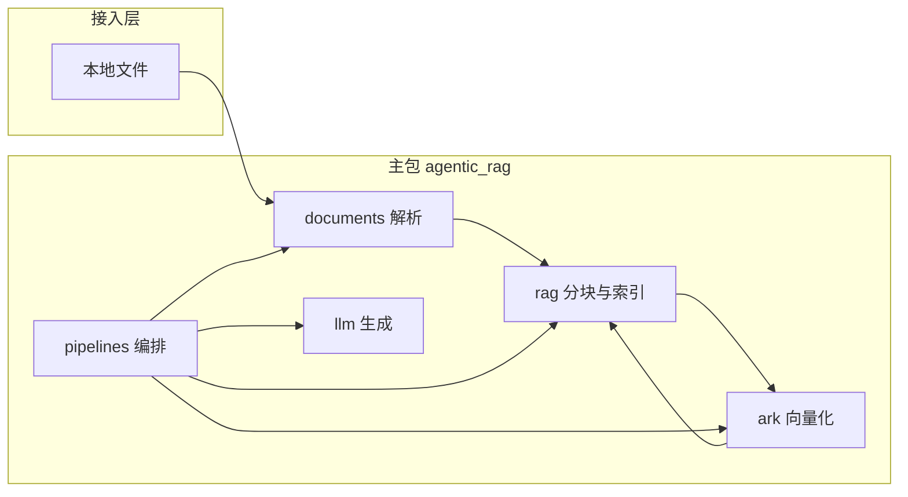

# C0 本地 RAG 基线代码架构说明

本文描述 **Topic4 Agentic RAG Evaluation** 仓库在整合后的代码布局、数据流、模块职责与协作约定。运行方式仍以根目录 [README.md](README.md) 为准。

**代码性质：** 当前可运行主体是从 `Agentic-RAG-110` 迁入并置于本仓库框架内的 **C0 Naive RAG / 单文档本地 RAG 基线**，已在 **`experiment` + `main.py rag`** 上接通 **C1 query rewrite** 与 **稠密+BM25 混合检索**（可用开关关闭）；rerank、多轮检索、任务规划、外部工具、self-check、批量评测流水线等仍属扩展阶段。后续 C1–C4 在同一仓库迭代，`configs/`、`runs/`、`prompts/` 与 `src/agentic_rag/` 协同演进。

---

## 1. 仓库整合后的定位


| 组成部分         | 说明                                                                                    |     |
| ------------ | ------------------------------------------------------------------------------------- | --- |
| **课题框架**     | `docs/`、`data/`、`runs/`、`prompts/`、`configs/`（占位）等目录与协作文档，对应 C0–C4 实验与评测预留位置。         |     |
| **C0 可执行实现** | Python 包 `src/agentic_rag/` + 根目录 `main.py`、`demo.py`、`rag_demo.py`、`upload_demo.py`。 |     |
| **工程元数据**    | `pyproject.toml` / `uv.lock`、`.python-version`（当前 **3.12**）、`LICENSE`、`.env.example`。 |     |


整合后约定：**可复用逻辑全部在 `src/agentic_rag/`**；根目录只放入口脚本与工程配置；实验产物与规范说明按 `docs/directory_rules.md` 落在约定目录，避免与源码混杂。

---

## 2. 运行时数据流

本地文档 → **解析** → **分块** → **火山方舟多模态向量 API（仅文本项）** → **内存向量列表**（命中 **Chroma** 时跳过文档块向量化）→ **余弦 Top-K** → **DeepSeek 对话生成**。




**编排边界：** `pipelines` 是唯一把各层串成「一条 RAG 业务」的模块；`documents`、`ark`、`llm`、`rag` **不依赖** `pipelines`，避免循环引用。

### 2.1 入口分层（统一 CLI）

| 层级 | 职责 |
| --- | --- |
| **`documents` / `ark` / `rag` / `llm`** | 领域能力，互不依赖 `pipelines`。 |
| **`pipelines`** | `build_vector_index`、`retrieve_with_index`、`run_c0_with_index`、`run_c1_with_index` 等编排。 |
| **`experiment`** | `RunProfile`（模块开关）+ `run_document_rag`，供自动化与 JSON 输出。 |
| **根目录 `main.py`** | 子命令 **`rag`**（接 `run_document_rag`）、**`chat`**（仅 DeepSeek）；无子命令时保持旧版「仅对话」。新 CLI 参数加在 ``main.py``，**不必为每个功能再复制一个 demo**。 |
| **`run_rag.py`** | 等价于 ``python main.py rag …``。 |

---

## 3. 公共 API 与入口脚本（速查）

### 3.1 `pipelines` 对外暴露的三个函数

以下符号由 `agentic_rag.pipelines`（及 `pipelines/__init__.py`）导出，是 C0 业务入口：


| 函数                                                                | 行为摘要                                                                                       |
| ----------------------------------------------------------------- | ------------------------------------------------------------------------------------------ |
| `build_vector_index(doc_path, use_chroma=True)`                  | 优先 **Chroma** 命中则直接还原 `SimpleVectorIndex`；否则解析切块向量化；``use_chroma=False`` 时不读写磁盘。 |
| `answer_with_index(index, question, top_k=4, system_prompt=None)` | `embed_texts(..., is_query=True)` → `index.top_k` → 拼接上下文 → DeepSeek `chat.completions`。   |
| `local_rag_answer(doc_path, question, ...)`                       | 内部先 `build_vector_index`（Chroma 已缓存同一文档时不再向量化文档块）再 `answer_with_index`。            |


### 3.2 其它包的主要符号


| 模块               | 符号                                                     | 作用                                                         |
| ---------------- | ------------------------------------------------------ | ---------------------------------------------------------- |
| `documents`      | `parse_path`、`ParsedDocument`、`UnsupportedFormatError` | 单文件解析为纯文本。                                                 |
| `rag.simple`     | `chunk_text`、`cosine_sim`、`SimpleVectorIndex`          | 固定窗口分块（默认 `chunk_size=500`、`overlap=80`）、余弦相似度、内存 `top_k`。 |
| `rag.chroma_store` | `try_load_index`、`persist_index`                     | Chroma 磁盘持久化；见 `CHROMA_PERSIST_DIRECTORY`（默认 `E:\agentic_rag_chroma`）。 |
| `ark.embeddings` | `embed_texts`                                          | `POST .../embeddings/multimodal`；`is_query=True` 时为查询加前缀。  |
| `llm.deepseek`   | `create_deepseek_client`                               | OpenAI 兼容客户端，读 `config.DEEPSEEK_`*。                        |
| `config`         | `ARK_*`、`DEEPSEEK_*`、`CHROMA_PERSIST_DIRECTORY`      | 自项目根（及上一层）加载 `.env`。                                             |


### 3.3 根目录入口脚本对照


| 文件               | 是否走 RAG | 说明                                                         |
| ---------------- | ------- | ---------------------------------------------------------- |
| `main.py`        | 可选      | 子命令 **`rag`**：结构化 C0/C1 + `run_profile`；**`chat`**：仅 DeepSeek；无子命令时交互式仅对话（旧行为）。 |
| `run_rag.py`     | 是       | 等价于 ``main.py rag``。                                      |
| `demo.py`        | 是       | 一次 `build_vector_index`，循环 `answer_with_index`（文档不向量化第二遍）。 |
| `rag_demo.py`    | 是       | 两参数：文档路径 + 问题；`local_rag_answer` 全链路。                      |
| `upload_demo.py` | 是       | Gradio：`local_rag_answer`。                                 |


---

## 4. 目录树（整合后）

```
项目根/
├── main.py
├── run_rag.py
├── demo.py
├── rag_demo.py
├── upload_demo.py
├── pyproject.toml
├── uv.lock
├── .python-version          # 与 pyproject 一致，当前 3.12
├── .env.example
├── .gitignore
├── LICENSE
├── README.md
├── configs/                 # C0–C4 实验配置预留（当前可为空或仅 .gitkeep）
├── data/                    # 数据、知识库、测试集；processed 等见 .gitignore
├── docs/                    # 协作、目录规范、实验记录；含本文件 c0_baseline_architecture.md
├── prompts/                 # Prompt 模板（课题扩展）
├── runs/                    # 日志、结果表、图表（生成物多被 gitignore，保留 README 占位）
└── src/
    └── agentic_rag/
        ├── __init__.py       # 包版本等
        ├── config.py
        ├── documents/
        ├── ark/
        ├── llm/
        ├── rag/
        ├── pipelines/
        └── experiment/       # RunProfile、run_document_rag（由 main.py rag 调用）
```

### 4.1 包内文件职责（`src/agentic_rag/`）


| 路径                       | 作用                                                                         |
| ------------------------ | -------------------------------------------------------------------------- |
| `config.py`              | 从项目根加载 `.env`；`ARK_BASE_URL`、`ARK_API_KEY`、`ARK_EMBEDDING_*`；`DEEPSEEK_*`。 |
| `documents/__init__.py`  | 导出 `parse_path`、`ParsedDocument`、`UnsupportedFormatError`。                 |
| `documents/models.py`    | `ParsedDocument`（路径、正文等）。                                                  |
| `documents/parse.py`     | `.txt` / `.md` / `.pdf` / `.docx` → 纯文本。                                   |
| `documents/errors.py`    | `UnsupportedFormatError` 等。                                                |
| `ark/__init__.py`        | 导出 `embed_texts`。                                                          |
| `ark/embeddings.py`      | 方舟 multimodal 向量；`input: [{"type":"text","text":...}]`；批处理与降级逐条。           |
| `llm/__init__.py`        | 导出 `create_deepseek_client`。                                               |
| `llm/deepseek.py`        | 基于 `openai.OpenAI` 指向 DeepSeek。                                            |
| `rag/__init__.py`        | 导出 `SimpleVectorIndex`、`chunk_text`、`cosine_sim`。                          |
| `rag/simple.py`          | 分块、余弦相似度、`SimpleVectorIndex.top_k`。                                        |
| `pipelines/__init__.py`  | 导出 `build_vector_index`、`answer_with_index`、`local_rag_answer`、`run_c0_with_index`、`run_c1_with_index`。 |
| `pipelines/local_rag.py` | C0/C1 编排：索引、混合检索、改写与结构化输出。                                       |
| `experiment/profile.py` | `RunProfile`、YAML 加载与 BM25 分词解析。                                        |
| `experiment/runner.py`  | `run_document_rag`：按 Profile 调用 `run_c0` / `run_c1`。                     |


---

## 5. 依赖方向（约定）

- **允许：** `pipelines` → `documents` / `ark` / `llm` / `rag`。
- **禁止：** `documents`、`ark`、`llm`、`rag` → `pipelines`。
- `**config`：** 各层可读；不在 `config` 之外重复实现「读 `.env`」逻辑（入口通过 `import agentic_rag.*` 触发 `config` 加载即可）。
- **厂商边界：** 方舟、DeepSeek 调用集中在 `ark/`、`llm/`；检索与分块留在 `rag/`，便于替换供应商。

---

## 6. 协作规范

### 6.1 环境与密钥

- 复制 `.env.example` 为本地 `.env`，**永不提交** `.env`、密钥、Token。
- 提交前执行 `git status`，确认无敏感文件。
- 方舟 / DeepSeek 的 Model ID、Endpoint ID 以各控制台为准。

### 6.2 依赖与运行

- 使用 **uv**：`uv sync`；新增依赖后更新 `pyproject.toml` 并执行 `uv lock`。
- Python：`**>=3.12`**（见 `pyproject.toml` 与 `.python-version`）。

### 6.3 Git 与提交信息

- 建议采用 [Conventional Commits](https://www.conventionalcommits.org/zh-hans/)：
  - `feat:` 新功能  
  - `fix:` 修复  
  - `docs:` 文档（含 `README` / `docs/c0_baseline_architecture.md`）  
  - `refactor:` 重构（行为不变）  
  - `chore:` 构建、依赖、杂项  
- 示例：`feat(ark): support optional embedding batch size`

### 6.4 代码与文档同步

- 与厂商相关的调用集中在 `ark/`、`llm/`；检索与分块逻辑留在 `rag/`，便于替换向量或 LLM 供应商。
- 新增目录或公共 API 时，同步更新 `docs/c0_baseline_architecture.md` 与本包 `__init__.py` 的导出。
- 避免在无关文件中「顺手重构」；合并请求保持单一主题，便于审查。

### 6.5 文档分工

- **README.md**：课题定位、安装配置、运行命令与简要说明。
- **docs/c0_baseline_architecture.md**：面向贡献者的结构、公共 API、模块边界与协作约定（本文）。
- **`docs/`** 其余文档：分工流程、目录规则、实验笔记等。

---

## 7. 修订记录


| 日期   | 说明                                                                                                                |
| ---- | ----------------------------------------------------------------------------------------------------------------- |
| 整合更新 | 仓库纳入 Topic4 框架：补充整合定位、完整目录树、`configs/data/docs/runs` 等；增加公共 API 与入口脚本速查；Python 版本与 `pyproject.toml` 对齐为 **3.12**。 |


架构或目录有重大变更时，请在本表追加一行或在提交说明中简述，便于溯源。