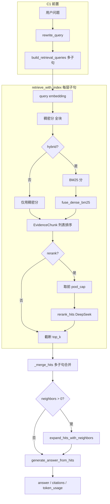

# C2 检索三层机制：叠加关系、数据流与参数说明

本文档面向开发与实验记录，说明 **混合检索（Hybrid）→ LLM 重排（Rerank）→ 邻接上下文扩展（Context expansion）** 三层如何在 **同一套 `run_c0_with_index` / `run_c1_with_index` 管线** 中叠加、数据如何流动、关键参数默认值与来源、以及如何验证实际生效。

---

## 1. 范围与术语

| 术语 | 含义 |
|------|------|
| **三层机制** | 检索侧的三种可选增强：**混合检索**、**重排**、**上下文补全（邻接扩展）**。三者按固定顺序串联，不是三个独立微服务。 |
| **C2 三阶段（消融脚本）** | `run_c2_retrieval_ablation.py` 中依次对比：仅开混合 → 再开重排 → 再开邻接；用于量化「每加一层」的收益与成本。 |
| **实现主文件** | `src/agentic_rag/pipelines/local_rag.py`（编排）、`rag/fusion.py`、`rag/bm25.py`、`rag/rerank.py`、`rag/context_expand.py`（算法细节）。 |

与 `configs/c2_advanced.yaml` 的关系：YAML 描述实验档位与 **vector_top_k / merged_top_k** 等「规格字段」；当前 **`RunProfile` 与 `profile_from_yaml_dict` 未完整映射 YAML 中所有检索细项**，运行时以 **代码默认值 + CLI/脚本参数 + `RunProfile`** 为准。详见 [experiment_stage_and_code_ownership.md](experiment_stage_and_code_ownership.md)。

---

## 2. 三层如何叠加与嵌套（顺序语义）

三层是 **严格顺序嵌套** 的「管道」，不是并行分支：

1. **第一层（混合）**：发生在 **`retrieve_with_index`** 内部，对每个检索子句，在 **全体块** 上算分；若 `hybrid=True`，分数由稠密余弦与 BM25 经 **`fuse_dense_bm25`** 融合得到。
2. **第二层（重排）**：仍在 **`retrieve_with_index`** 内、且在每个子句循环里；若 `rerank=True`，对 **该子句** 融合分排序后的 **前 `pool_cap` 条** 调用 **`rerank_hits`**，输出 **至多 `top_k` 条**，顺序可能改变。
3. **第三层（上下文补全）**：在 **`retrieve_with_index` 返回之后**，于 **`run_c0_with_index` / `run_c1_with_index`** 中调用 **`expand_hits_with_neighbors`**；对 **已合并后的 Top-K 列表** 逐条扩展 `text` 字段。

因此：**混合影响「谁进粗检前列」；重排影响「进最终合并 Top-K 的块及顺序」；扩展只影响「每条命中喂给生成的文本长度」，不改变 Top-K 条数与 `chunk_id` 集合（中心块 id 不变）。**

**嵌套要点**：C1 的 **多个检索子句** 在 `retrieve_with_index` 里 **各自** 走「稠密 → 可选混合 → 可选 rerank → 子句内 top_k」，再由 **`_merge_hits`** 跨子句去重合并为 **全局至多 top_k 条**。因此 **rerank 的 API 次数 ≈ 非空子句数**（在 `rerank=True` 且 `backend=llm` 时）。

---

## 3. 数据流与对象边界

### 3.1 核心数据结构

- **`SimpleVectorIndex`**：`chunks`（全文块列表）、`vectors`（与块一一对齐）、可选 `chunk_metadata`（含 `chunk_id`、`doc_id`、`source` 等）。
- **`EvidenceChunk`**：一次检索/生成链路中的「证据条目」；扩展后 **`text` 变长**，**`chunk_id` 仍表示中心块**（用于引用与日志）。

### 3.2 各阶段输入输出边界

| 步骤 | 输入 | 输出 |
|------|------|------|
| Query 向量化 | 每个非空检索子句文本 | 与子句数一致的 query 向量 |
| 稠密打分 | query 向量 × 每块向量 | 每块一个余弦相似度 |
| 混合融合（若开） | 稠密分列表 + BM25 分列表（等长） | 每块一个融合分 |
| 子句内排序与截断 | 带分的 `EvidenceChunk` 列表 | 排序后取 `pool_cap` 或 `top_k` |
| Rerank（若开） | `pool_cap` 条、`top_k`、backend | **至多 top_k** 条，**序可变**；`rerank` 后 `score` 为序分数，**不宜再当相似度** |
| 多子句合并 | 各子句的 top 列表 | **去重后至多 top_k**（`_merge_hits`） |
| 邻接扩展（若开） | 合并后的 hits + `index` + `neighbors` | **同条数**；每条 `text` 可能变为多块拼接 |
| 答案生成 | 扩展后 hits + 原问题 | `answer`、DeepSeek usage |

### 3.3 邻接扩展的语义边界

- 扩展依据 **`chunk_id` 末尾 `::chunk_整数`** 解析出在 **`index.chunks` 全局下标** 中的位置，向两侧取 **±N 个物理邻块** 拼接。
- **`index.chunks` 为全库扁平顺序**（按 `documents.csv` 遍历顺序切块），**邻接可能跨文档**（上一篇最后一块与下一篇第一块在索引上相邻时会被拼在一起）。这是实验解读与改进（按 `doc_id` 裁剪邻接）时的重要边界。
- 若 `chunk_id` 无法解析为上述形态，**该条不扩展**。

---

## 4. 关键参数：默认值、代码位置、为何这样设

### 4.1 总表（与当前代码一致）

| 参数 | 典型默认值 | 定义 / 使用位置 | 作用简述 |
|------|------------|-----------------|----------|
| **`top_k`** | `5` | `RunProfile.top_k`；`run_c2_retrieval_ablation.py --top-k`；`run_c1_with_index(..., top_k=)` | 最终进入生成上下文（及引用列表）的 **证据条数上限**（合并后）。5 是常见 RAG 默认值，平衡上下文长度与噪声。 |
| **`hybrid`** | `RunProfile.use_hybrid_retrieval=True`；C2 阶段 1–3 均为 True | `retrieve_with_index(..., hybrid=)` | 是否做稠密+BM25 融合。 |
| **`dense_weight` / `bm25_weight`** | `0.6` / `0.4` | `RunProfile`；`fuse_dense_bm25`；C2 脚本 `--dense-weight` `--bm25-weight` | 融合前各做 min-max，再线性加权；**0.6/0.4** 表示略偏语义向量、仍给词法匹配显著权重，适合中英混合技术文档。 |
| **`bm25_tokenizer`** | `"bigram"` | `RunProfile.bm25_tokenizer` → `resolve_bm25_tokenizer` | 中文 Bigram 无额外依赖，与 `bm25.py` 一致。 |
| **`use_rerank`** | `RunProfile` 默认 **False**；C2 阶段 2–3 为 True | `retrieve_with_index(..., rerank=)` | 是否调用 `rerank_hits`。默认关：**省钱省延迟**；消融脚本在阶段 2 起打开。 |
| **`rerank_backend`** | `"llm"` | `RunProfile.rerank_backend`；C2 `--rerank-backend llm|none` | `llm`：DeepSeek 排序；`none`：**不调 rerank API**，等价于按融合分截断（对照实验）。 |
| **`rerank_pool_size`** | `20` | `RunProfile.rerank_pool_size`；C2 `--rerank-pool`；`retrieve_with_index` 中 `pool_cap` | 粗检进入 LLM rerank 的 **最大候选数**；与 `top_k` 取 `max(top_k, min(rerank_pool_size, len(scored)))`。20 在「覆盖更多纠错机会」与「prompt 长度/token」之间折中。 |
| **`rerank_hits.max_passage_chars`** | **480**（代码常量） | `rag/rerank.py` `rerank_hits(..., max_passage_chars=480)` | 每条进 LLM 的片段 **硬截断**，控制 rerank 单次 prompt；过长证据可能被截掉关键句，是 **效果边界** 来源之一。 |
| **`context_neighbor_chunks`** | `RunProfile` 默认 **0**；C2 阶段 3 为 CLI **`--neighbors`**（默认 **1**） | `expand_hits_with_neighbors(..., neighbors=)` | 每条中心块向两侧扩展的块数；**1** 表示「±1 块」，改动小、便于先看增益是否被跨块截断解释。 |
| **切块（索引构建）** | `CHUNK_SIZE=500`, `CHUNK_OVERLAP=80` | `kb_index_builder.py` 常量 | 决定物理块粒度；与 `configs/c1_rewrite.yaml` 中 `chunk_size/overlap` 描述一致思路；**检索三层不改变切块**，只改变检索与展示。 |

### 4.2 C2 消融脚本中的阶段与开关对应

来源：`run_c2_retrieval_ablation.py` 中 `VARIANTS` 与 `build_c2_ablation_parser`。

| 阶段 key | hybrid | use_rerank | context_neighbor_chunks（脚本） |
|----------|--------|------------|-------------------------------------|
| `c2_stage1_c1_hybrid` | True | False | 0 |
| `c2_stage2_c1_hybrid_rerank` | True | True | 0 |
| `c2_stage3_c1_hybrid_rerank_context` | True | True | **`args.neighbors`（默认 1）** |

其它脚本级默认：`--limit 20`、`--phase all`、`--rerank-backend llm`、`--top-k 5`、`--rerank-pool 20`、`--dense-weight 0.6`、`--bm25-weight 0.4`。

---

## 5. 参数从哪里传入、优先级如何

### 5.1 `main.py rag`（单文档全链路）

合并顺序（见 `cli/app.py` **`cmd_rag`** 注释与代码）：

1. **`RunProfile()` 默认字段**  
2. **`configs/active_session.yaml`**（若存在）→ `apply_active_session`  
3. **`-c/--config` YAML** → `load_profile_yaml` + `merge_profile_dict(profile, overlay.to_dict())`（**仅覆盖 YAML 已映射字段**）  
4. **CLI 显式开关**：`--no-hybrid`、`--no-rerank`、`--rerank`、`--no-rewrite`、`--no-chroma`、`--log` 等  
5. **CLI 数值**：`--dense-weight`、`--bm25-weight`、`--top-k`、`--rerank-backend`、`--rerank-pool`、`--context-neighbors` → 再 `merge_profile_dict`

随后 **`run_document_rag`** 把 `profile` 打成 `common_kwargs` 传入 `run_c1_with_index`（见 `experiment/runner.py`）。

### 5.2 `run_c2_retrieval_ablation.py`（全库三阶段消融）

- **不经过** `RunProfile`：在 `run_variant` 里构造 **`common` 字典**（`top_k`、`hybrid`、`use_rerank`、`context_neighbor_chunks`、`rerank_backend`、`rerank_pool_size`、`dense_weight`、`bm25_weight` 等），直接 **`**common` 传入 `run_c1_with_index`**。  
- 与 `main.py rag` 的 profile 可 **数值上对齐**（同样默认 5/20/0.6/0.4），但 **来源不同**；改一处不会自动改另一处。

### 5.3 `deep_planning/presets.py`（Agent 工具选管线）

- `c2_stage1_hybrid` / `c2_stage2_rerank` / `c2_stage3_context` 映射到 **`RunProfile` 拷贝**，供 `run_knowledge_base_rag` / `run_document_rag` 使用；**不单独实现** 另一套检索公式。

---

## 6. 如何确认「实际跑的是哪组参数」

| 方法 | 能看到什么 |
|------|------------|
| **`run_document_rag` / `run_knowledge_base_rag` 返回 JSON** | 内含 **`run_profile`**：与 `RunProfile.to_dict()` 一致，可核对 `use_hybrid_retrieval`、`use_rerank`、`rerank_pool_size`、`context_neighbor_chunks`、`top_k`、`dense_weight`、`bm25_weight` 等。 |
| **C2 消融产物 `runs/results/c2_ablation_summary.json`** | `summary` 中含本次 **`top_k`、`rerank_pool_size`、`rerank_backend`、`dense_weight`、`bm25_weight`、`neighbors_stage3`** 等（见 `run_c2_ablation_from_args` 写入）。 |
| **扩展 CSV 列** | `hybrid`、`use_rerank`、`context_neighbor_chunks`、`rerank_total_tokens` 等（`c2_ablation_metrics.row_extend_ablation`）。 |
| **逐题 JSONL** | `runs/logs/<variant>/run_logs.jsonl` 中每行含 `retrieved_chunks`、`token_usage`（含 `rerank`、`ark_volcengine_embedding`、`query_rewrite` 等）。 |
| **代码断点 / 日志** | 在 `retrieve_with_index` 入口打印 `hybrid`、`rerank`、`rerank_pool_size`；在 `expand_hits_with_neighbors` 前打印 `neighbors`。 |

若 **`rerank_backend=none`**：不应出现 rerank 相关 DeepSeek token（或极少）；若 **`context_neighbor_chunks=0`**：扩展函数立即返回，命中 `text` 等于单块原文。

---

## 7. 这样设置的好处（设计动机摘要）

| 设计 | 好处 |
|------|------|
| **三层顺序固定** | 语义清晰：先定「候选与序」，再定「给模型看的字面上下文」；便于消融与排错。 |
| **混合默认略偏稠密（0.6/0.4）** | 以语义为主、BM25 纠偏，适合技术文档 + 口语 query 改写后的检索子句。 |
| **rerank 池大于 top_k（如 20 vs 5）** | 给 LLM 更大「纠错空间」；再大则 prompt 与延迟上升。 |
| **rerank 片段 480 字符** | 控制单次 rerank 成本与超时风险；代价是可能丢失块内细节。 |
| **邻接默认 N=1** | 低成本尝试缓解「切块边界切断句子」；N 过大易引入噪声与跨文档拼接。 |
| **C2 脚本与 `RunProfile` 默认值对齐** | 使「命令行单次 RAG」与「批量消融」在**未改参数时**行为可比（仍注意两套入口独立维护）。 |

---

## 8. 收益与成本（与三层边界对照）

- **混合检索**：主要提升 **粗检召回与排序**（尤其词面匹配）；成本以 **计算与略增延迟** 为主，**无** rerank 级 LLM 开销。  
- **Rerank**：主要提升 **池内顺序** 与「真金已在池内」时的答案质量；成本为 **每子句一次（或多次）DeepSeek 调用** 与 **延迟**；**无法召回** pool 外的块。  
- **上下文扩展**：主要提升 **单条证据可读性与跨块连贯**；**不改变** Top-K 的 `chunk_id` 集合；成本为 **生成 prompt 变长**；存在 **跨文档邻接** 风险。

---

## 9. 相关文档与代码索引

| 资源 | 路径 |
|------|------|
| C2 消融用法 | [c2_ablation_guide.md](c2_ablation_guide.md) |
| 档位与 YAML / 代码对齐 | [experiment_stage_and_code_ownership.md](experiment_stage_and_code_ownership.md) |
| 编排与模块总览 | [ARCHITECTURE.md](ARCHITECTURE.md) |
| 三阶段脚本 | `run_c2_retrieval_ablation.py` |
| 管线实现 | `src/agentic_rag/pipelines/local_rag.py` |
| Rerank / 融合 / 扩展 | `src/agentic_rag/rag/rerank.py`、`fusion.py`、`context_expand.py`、`bm25.py` |
| 运行配置 | `src/agentic_rag/experiment/profile.py`、`experiment/runner.py` |

---

*文档版本：与仓库当前实现一致；若修改 `RunProfile` 默认值、`rerank_hits` 截断长度或 C2 脚本 argparse，请同步更新本文第 4、5 节。*
